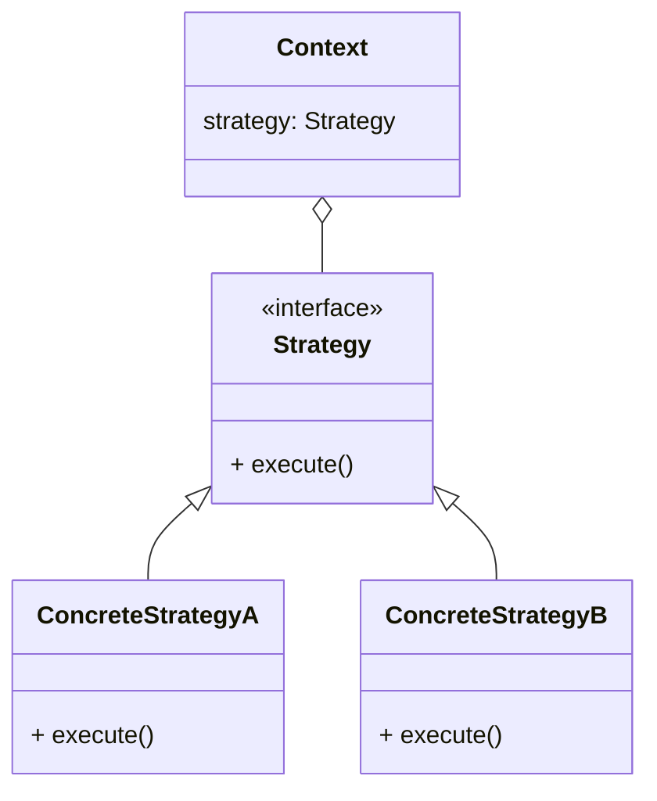

これは [SMat Advent Calendar 2024](https://qiita.com/advent-calendar/2024/s-mat) の12/19分の記事です。

こんにちは、株式会社エスマットにてバックエンドを中心に開発をしています、野島といいます。
私は GoF の Strategy パターンが好きでよく使います。弊社では在庫管理プロダクトを提供しており、その中に「マスタデータをファイルアップロードで更新する機能」があります。この機能の実装に Strategy パターンを利用しています。

本記事では Strategy パターンの概要を簡単に説明した後、パターン適用例としてファイルアップロード処理の実装について共有します。

# Strategy パターンの概要



Strategyパターンはアルゴリズムをカプセル化して交換可能にします。

- Strategy: アリゴリズムに共通するインターフェイスを定義します
- ConcreteStrategy: Strategy インターフェイスを利用してアルゴリズムの実装をします
- Context: Strategy への参照を保持します

このパターンのよいところは構造を変えずに拡張できるところだと思います。
新しい振る舞いを追加したい場合は、Strategyの実装を追加することで対応できます。

# ファイルアップロード処理にパターンを適用する


上記の画像は、弊社で提供しているファイルアップロード画面です。
この画面では、次の機能を提供しています。


1. アップロードされたファイルを解析してマスタデータを更新
ファイルの内容を解析し、マスタデータを更新します。
例えば、商品情報更新CSVや場所情報更新CSVといった異なる種類のファイルが存在します。ファイル種類に応じて更新処理が変わります。
 
1. アップロード結果の確認
処理結果を記録し、アップロードが成功したか、またはエラーが発生したかを確認できます。

これらの機能を実現するために、Strategy パターンを用いて拡張性の高い設計を採用します。

#### Strategy パターンを用いた設計

ファイルの種類ごとに異なる処理ロジックが必要な場合、すべてを1つのクラスに実装すると、コードが肥大化して複雑になり、変更時のリスクが増大します。また、新しいファイル種別に対応する際に既存のコードを修正する必要があり、メンテナンス性が低下する原因にもなります。

そこでパターンを利用し、処理ロジックをインターフェースに抽象化します。
これにより、ファイル種別ごとに処理ロジックを独立した形で実装できるようになります。

**Strategy パターンの適用によるメリット**：

- **拡張性**
新しいファイル種別に対応する場合、新たな具体的な処理ロジックをインターフェースを基に作成するだけで対応可能です。既存のコードに手を加える必要がありません。

- **保守性**
ファイルごとの処理ロジックが独立しているため、特定の処理を変更しても他の処理には影響を与えません。また、コードが分離されているため、各処理のテストやデバッグも容易になります。

以下、コード例です(go)。FileProcessStrategy をインターフェースとして定義し、商品情報の更新と、場所情報の更新をそれぞれ独立した実装をします。

```go
// ファイル処理のインターフェイス
// 各種ファイルの処理を抽象化する
type FileProcessStrategy interface {
    Process() error
}

// 商品情報更新用の具体的な処理
// 商品マスタのデータを更新するロジックを含む
type ProductUpdateStrategy struct {}
func (p *ProductUpdateStrategy) Process() error {
    // 商品情報の更新処理
    // ...
    return nil
}


// 場所情報更新用の具体的な処理
// 在庫の場所情報を更新するロジックを含む
type LocationUpdateStrategy struct {}
func (l *LocationUpdateStrategy) Process() error {
    // 場所情報の更新処理
    // ...
    return nil
}
```

さらに、Usecase(Context役) は、ファイル種別に応じて適切な処理ロジックを動的に切り替えます。この構造により、ロジックの変更や追加が容易になります。


```go
type Usecase struct {
    strategy FileProcessStrategy
}

func (r *Usecase) Do() {
    err := r.strategy.Process()
    if err != nil {
        // エラー情報をDBに保存する
        saveErrorLogToDB(err)
        return
    }
    // ファイル処理成功をDBに保存する
    saveSuccessLogToDB()
}
```

#### Context と Strategy の役割

- **Context (`Usecase`)**: ファイル処理の結果を記録し、`FileProcessStrategy` の具体的な処理を呼び出します。
- **Strategy (`FileProcessStrategy`)**: ファイルの種別に応じた具体的な処理を行います。

これにより、新しいファイル種別が必要になったときに、新たな `ConcreteStrategy` を実装して `Usecase` に渡すだけで機能を拡張できます。

# まとめなど

本記事では Strategy パターンの説明と、プロダクトにおける適用例を紹介しました。
パターンによりアルゴリズムが交換可能となり、拡張性、保守性があがる例を示しました。

Strategy パターンは汎用性が高くて、ある処理を交換可能にしようとした場合に、自然とたどり着くパターンかなと個人的には思います。
本記事がなんらかの形で参考になれば幸いです。

# 参考

- [オブジェクト指向における再利用のためのデザインパターン(改訂版）](https://www.sbcr.jp/product/4797311126/)
- [Strategy pattern - Wikipedia(英語版)](https://en.wikipedia.org/wiki/Strategy_pattern)
- [Strategy パターン - Wikipedia(日本語版)](https://ja.wikipedia.org/wiki/Strategy_%E3%83%91%E3%82%BF%E3%83%BC%E3%83%B3)
