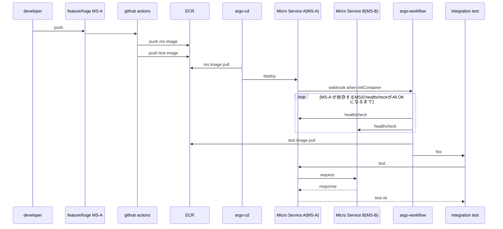

```mermaid
sequenceDiagram 
    participant dev as developer
    participant git as feature/hoge MS-A
    participant act as github actions
    participant ecr as ECR
    participant cd as argo-cd
    participant msa as Micro Service A(MS-A)
    participant msb as Micro Service B(MS-B)
    participant workflow as argo-workflow
    participant it as integration test

    dev ->> git: push
    git ->> act: 
    act ->> ecr: push ms image
    act ->> ecr: push test image
    cd ->> ecr: ms image pull
    cd ->> msa: deploy
    msa->>workflow: webhook when initContainer
    loop MS-A が依存するMSのhealthcheckがAll OK になるまで
        workflow ->> msa: healthcheck
        workflow ->> msb: healthcheck
    end
    
    workflow ->> ecr: test image pull
    workflow ->> it: fire
    
    it ->> msa: test
    msa ->> msb: request
    msb -->> msa: response
    msa -->> it: test ok
    
```