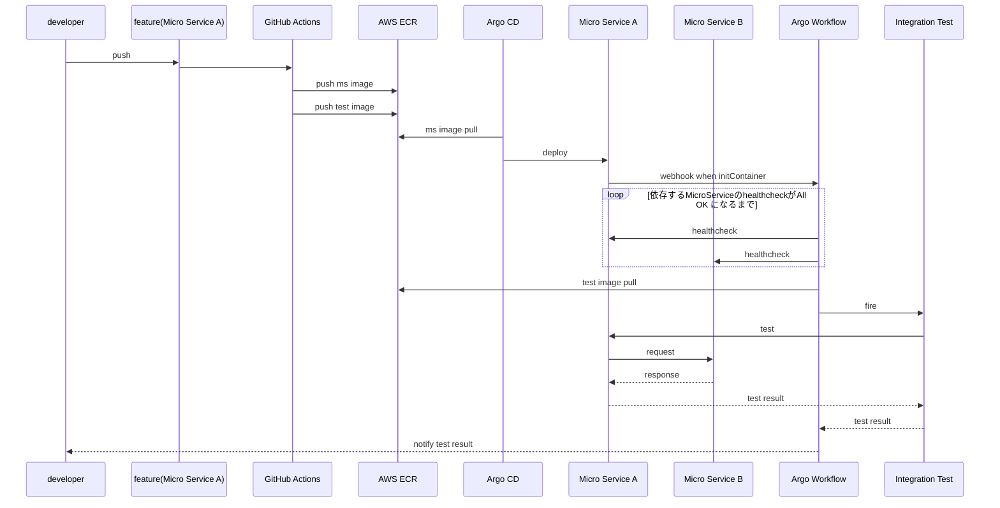

```mermaid
sequenceDiagram 
    participant dev as developer
    participant git as feature(Micro Service A)
    participant act as GitHub Actions
    participant ecr as AWS ECR
    participant cd as Argo CD
    participant msa as Micro Service A
    participant msb as Micro Service B
    participant workflow as Argo Workflow
    participant it as Integration Test

    dev ->> git: push
    git ->> act: 
    act ->> ecr: push ms image
    act ->> ecr: push test image
    cd ->> ecr: ms image pull
    cd ->> msa: deploy
    msa->>workflow: webhook when initContainer
    loop 依存するMicroServiceのhealthcheckがAll OK になるまで
        workflow ->> msa: healthcheck
        workflow ->> msb: healthcheck
    end
    
    workflow ->> ecr: test image pull
    workflow ->> it: fire
    
    it ->> msa: test
    msa ->> msb: request
    msb -->> msa: response
    msa -->> it: test result
    it -->> workflow: test result
    workflow -->> dev: notify test result
```